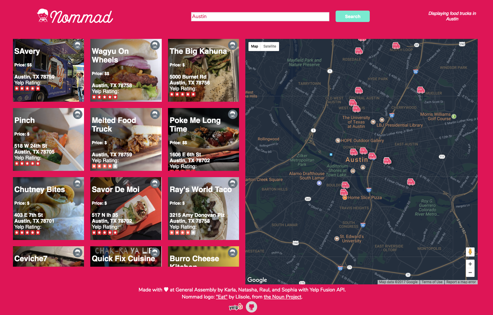

# *LOGO* Welcome to Nommad

Nommad is a food-truck finder app that helps foodies efficiently search for the yummiest noms/food trucks nearby. This app is for both desktop and mobile platforms, inspired by and designed for Austin, TX.

[Check out Nommad in action](https://nommad-app.firebaseapp.com/)

Created by Raul Gutierrez, Sophia Chow, Natasha Robarge, and Karla Moreno.

## How To Use
- You can easily search for food trucks in the search bar by zipcode and/or city name. Our app will automatically render a maximium of 20 food trucks within a 1 mile radius of the search. When you click on the tile/food truck of your choice, it will take you to the Yelp page for more information. 

## Technologies Used
This project was built using:
- React.js
- Yelp Fusion API
- Google Maps API
- axios
- Firebase
- Nommad's very own backend server: [Github repository](https://github.com/deathnaut/nommad-backend), [Live server](http://nommad-backend.herokuapp.com/)
  - Express
  - Heroku

## Plans For The Future

1. Add a Nom counter to each food truck tile so that users know how any noms/up-votes a certain truck has.
2. Tying the tiles with the map markers.
3. Adding users.
4. The ability for food trucks to add their business.
5. Adding pop-up profile pages.
6. Links to menu and directions. 

